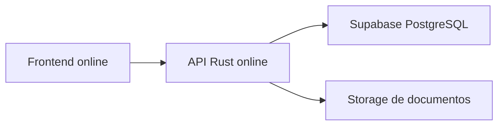

# Deploy gerido sem servidor proprio

Objetivo: colocar GESTISAC online sem depender do computador pessoal e sem gerir uma VPS manualmente.

Para operacao diaria, deploys e clones, usar tambem `docs/33-operacao-deploy-e-clones.md`.

## Decisao recomendada

Usar a arquitetura atual do projeto:



- Supabase fica com o PostgreSQL gerido.
- Vercel, Render, Railway ou Cloud Run ficam com a API Rust.
- Vercel, Firebase Hosting, Netlify ou Cloudflare Pages ficam com o frontend.
- `127.0.0.1` fica apenas para desenvolvimento local.

## Porque Supabase e nao Firestore

O codigo atual usa PostgreSQL, SQLx, migrations SQL e repositories relacionais. Supabase encaixa diretamente porque cada projeto tem uma base PostgreSQL completa.

Firestore e Firebase Realtime Database sao NoSQL. Usar Firestore exigiria reescrever a persistencia, autorizacao e grande parte das queries.

Firebase SQL Connect tambem usa PostgreSQL gerido, mas introduz schema/queries/mutations por GraphQL e SDKs proprios. Pode ser uma opcao futura, mas para o estado atual do codigo e mais direto usar Supabase Postgres.

Referencias oficiais:

- Supabase Database: https://supabase.com/docs/guides/database/overview
- Firebase SQL Connect: https://firebase.google.com/docs/sql-connect
- Firebase Firestore: https://firebase.google.com/docs/firestore

## O que fica em cada plataforma

### Supabase

Criar um projeto e recolher:

- connection string Postgres;
- password da base;
- regiao;
- backups conforme o plano escolhido.

Usar a connection string em `GESTISAC_DATABASE_URL`.

Para plataformas serverless, preferir a string pooled do Supabase.

### API

Publicar `apps/api`.

Variaveis obrigatorias:

```env
GESTISAC_ENV=production
GESTISAC_DATABASE_URL=postgresql://...
GESTISAC_RUN_MIGRATIONS=false
GESTISAC_SYNC_ON_STARTUP=false
JWT_SECRET=<segredo-forte>
GESTISAC_CORS_ORIGINS=https://gestisac.example.com,https://hq.gestisac.example.com
GESTISAC_ALLOW_DEMO_SEED=false
```

Em Vercel, o projeto ja tem `apps/api/vercel.json` e `apps/api/api/server.rs`.

Em Render, Railway ou Cloud Run, usar o binario Rust `gestisac-api`.

### Frontend

Publicar as apps web e definir:

```env
VITE_API_BASE_URL=https://api.gestisac.example.com
```

Nunca usar `http://127.0.0.1:3000` em producao.

## Dados iniciais

Nao usar `GESTISAC_ALLOW_DEMO_SEED=true` em producao.

Fluxo recomendado:

1. Criar Supabase.
2. Aplicar migrations da API.
3. Importar dados iniciais por script de migracao revisto.
4. Criar ou validar o primeiro utilizador administrador.
5. Correr smoke test contra a API online.

Nota: em Vercel/serverless, as migrations SQLx devem ficar desligadas no arranque normal. Usa `GESTISAC_RUN_MIGRATIONS=true` apenas numa rollout controlada de esquema, e volta a desligar depois.

Tambem em Vercel/serverless, a sincronizacao automatica no arranque deve ficar desligada. Mantem `GESTISAC_SYNC_ON_STARTUP=false`; usa `true` apenas numa operacao controlada, fora do fluxo normal de deploy.

Comando de validacao:

```bash
GESTISAC_API_URL=https://api.gestisac.example.com pnpm run smoke:api
```

## Storage de documentos

O backend ainda usa path local para documentos. Em ambiente gerido existem duas opcoes:

- plataforma com volume persistente, por exemplo Render disk;
- adaptar documentos para Supabase Storage ou outro object storage.

Para Vercel serverless, filesystem local nao deve ser tratado como armazenamento permanente.

## Guardrails antes de deploy

Antes de publicar:

```bash
pnpm run check:prod-env -- --target api
pnpm run check:api
node scripts/run-cargo.mjs fmt --manifest-path apps/api/Cargo.toml -- --check
pnpm run clippy:api
pnpm run test:api
```

Depois de publicar:

```bash
GESTISAC_API_URL=https://api.gestisac.example.com pnpm run smoke:api
```

## O que ainda depende do dono do projeto

Estas acoes exigem login/credenciais externas:

- criar ou autorizar acesso ao projeto Supabase;
- criar ou autorizar acesso ao projeto Vercel/Render/Railway/Cloud Run;
- configurar dominio real;
- configurar metodo de pagamento se a plataforma exigir.

Sem essas credenciais, o repositorio pode ficar pronto, mas nao pode ser realmente publicado online.
