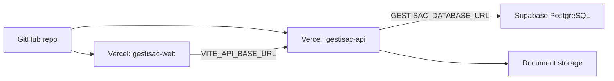
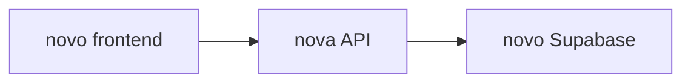

# Operacao, deploy e clones

Este documento define como o GESTISAC esta ligado entre GitHub, Vercel, Supabase e Codex. Deve ser lido antes de qualquer deploy, push, commit, migracao ou criacao de clone.

## Objetivo

Evitar redescobrir a arquitetura a cada intervencao.

O GESTISAC deve correr online assim:



`127.0.0.1` e `localhost` sao apenas para desenvolvimento local.

## Estado atual conhecido

### GitHub

Repositorio remoto:

```text
https://github.com/magnusverdum-dev/gestisac.git
```

### Vercel

Conta autenticada localmente:

```text
magnusverdum-6049
```

Organizacao/team:

```text
magnusverdum-6049s-projects
```

Projetos:

```text
gestisac-web
https://gestisac-web.vercel.app

gestisac-api
https://gestisac-api.vercel.app
```

Variaveis existentes em `gestisac-web`:

```text
VITE_API_BASE_URL
```

Variaveis existentes em `gestisac-api`:

```text
GESTISAC_DATABASE_URL
GESTISAC_ALLOW_DEMO_SEED
GESTISAC_ENV
GESTISAC_RUN_MIGRATIONS
GESTISAC_SYNC_ON_STARTUP
JWT_SECRET
GESTISAC_CORS_ORIGINS
GESTISAC_DOCUMENT_STORAGE_PATH
GESTISAC_DATA_PATH
```

### Supabase

MCP Codex configurado:

```text
project_ref=sauxmfoexgmjjkyoadpx
features=docs,account,database,debugging,development,functions,branching,storage
```

MCP status esperado:

```text
enabled
OAuth
```

Importante: MCP Supabase e Supabase CLI sao autenticacoes diferentes. O MCP pode estar autenticado mesmo que `npx supabase projects list` ainda peca `SUPABASE_ACCESS_TOKEN`.

## Regras que nao se quebram

- Nunca usar `localhost` ou `127.0.0.1` em variaveis de producao.
- Nunca publicar `GESTISAC_ALLOW_DEMO_SEED=true`.
- Nunca colocar `JWT_SECRET`, `GESTISAC_DATABASE_URL`, service keys ou passwords no Git.
- Nunca assumir que Vercel tem storage persistente.
- Nunca tratar `apps/api/data/store.json` como base de dados de producao.
- Antes de deploy de API nova, confirmar que `GESTISAC_DATABASE_URL` existe se `GESTISAC_ENV=production`.
- Nunca usar `--archive=tgz` para o frontend. Esse fluxo ja causou upload gigante de artefactos locais.

## Ficheiros importantes

- `apps/api/vercel.json`: roteamento da API na Vercel.
- `apps/api/api/server.rs`: entrypoint serverless da API Rust na Vercel.
- `apps/web/vercel.json`: headers e rewrites do frontend.
- `.env.production.example`: template geral de producao.
- `apps/api/.env.production.example`: template da API.
- `apps/web/.env.production.example`: template do frontend.
- `scripts/check-production-env.mjs`: verifica se ambiente de producao tem valores perigosos.
- `scripts/check-production-api.mjs`: testa endpoints reais da API com login autenticado, sem imprimir token.
- `scripts/check-vercel-projects.mjs`: confirma Root Directory esperado dos projetos Vercel.
- `docs/32-managed-cloud-deployment.md`: plano de cloud gerida.
- `docs/29-go-live-checklist.md`: checklist de go-live.

## Deploy normal

### 1. Validar localmente

```bash
pnpm run check:api
node scripts/run-cargo.mjs fmt --manifest-path apps/api/Cargo.toml -- --check
pnpm run clippy:api
pnpm run test:api
pnpm run build:web
```

Para validar variaveis de producao, correr com as variaveis reais carregadas:

```bash
pnpm run check:prod-env -- --target api
pnpm run check:prod-env -- --target web
pnpm run check:vercel-projects
```

### 2. Deploy do frontend

Comandos:

```bash
pnpm run deploy:web:build
pnpm run deploy:web:prod
```

O primeiro comando chama `scripts/vercel-build-web-production.mjs`.
Esse script faz `vercel pull --environment=production`, carrega `.vercel/.env.production.local`
para o processo de build e so depois executa `vercel build --prod`.
Isto e obrigatorio para o bundle Qwik/Vite receber `VITE_API_BASE_URL` em tempo de build.

O frontend deve usar sempre deploy prebuilt. O upload esperado e pequeno; se tentar subir centenas de MB ou milhares de ficheiros, parar.
Estado estabilizado em 2026-06-04: upload Web cerca de `1.3MB`.

Validar:

```bash
curl https://gestisac-web.vercel.app/hq/login
```

### 3. Deploy da API

Diretorio:

```bash
cd apps/api
```

Antes de deploy, confirmar env:

```bash
npx vercel env ls
```

Nao fazer deploy da API em producao se faltar:

```text
GESTISAC_DATABASE_URL
```

Depois de configurado:

```bash
pnpm run deploy:api:prod
```

Validar:

```bash
curl https://gestisac-api.vercel.app/api/health
GESTISAC_SMOKE_PASSWORD=<password> pnpm run check:prod-api
npx vercel logs https://gestisac-api.vercel.app --since 15m --status-code 500 --json --cwd apps/api
```

Estado estabilizado em 2026-06-04: upload API cerca de `185KB`.

Estado correto esperado:

```json
{
  "status": "online",
  "persistence": {
    "activeBackend": "postgresql",
    "databaseConfigured": true
  }
}
```

## Primeiro deploy com Supabase

### 1. Confirmar MCP

```bash
codex mcp get supabase
```

Se `codex.exe` do WindowsApps falhar com `Access is denied`, usar o binario interno indicado em `~/.codex/config.toml` em `CODEX_CLI_PATH`.

### 2. Obter connection string PostgreSQL

No Supabase:

```text
Project Settings -> Database -> Connection string
```

Para a API Rust/SQLx em Vercel, usar o pooler em modo session na porta `5432`.
Este foi o estado estabilizado em 2026-06-04.

```text
Session pooler
```

Formato esperado:

```text
postgresql://postgres.<project-ref>:<password>@<region>.pooler.supabase.com:5432/postgres
```

Nota: o transaction pooler na porta `6543` pode falhar com prepared statements em drivers como SQLx. A API tambem desativa cache de statements no cliente, mas o ambiente de producao confirmado usa `5432` com pool pequeno.

### 3. Configurar na Vercel API

Diretorio:

```bash
cd apps/api
```

Comando:

```bash
"postgresql://..." | npx vercel env add GESTISAC_DATABASE_URL production
```

Outras variaveis obrigatorias:

```text
GESTISAC_ENV=production
GESTISAC_ALLOW_DEMO_SEED=false
GESTISAC_RUN_MIGRATIONS=false
GESTISAC_SYNC_ON_STARTUP=false
JWT_SECRET=<strong-secret>
GESTISAC_CORS_ORIGINS=https://gestisac-web.vercel.app
```

### 4. Aplicar migrations e dados

A API nao deve correr migrations SQLx em cada arranque de producao. Mantem `GESTISAC_RUN_MIGRATIONS=false` no fluxo normal e ativa `GESTISAC_RUN_MIGRATIONS=true` apenas para uma rollout controlada de esquema.

A API tambem nao deve sincronizar snapshots automaticamente em cada arranque de producao. Mantem `GESTISAC_SYNC_ON_STARTUP=false`; usa `true` apenas numa operacao controlada, fora do fluxo normal de deploy.

Para dados iniciais, usar script revisto de migracao/importacao, nunca seed demo ligado em producao.

Depois:

```bash
GESTISAC_API_URL=https://gestisac-api.vercel.app pnpm run smoke:api
```

## Criar clone/site novo

Um clone pode significar duas coisas diferentes. Escolher antes de executar.

### A. Clone visual com a mesma API/base

Usar quando o site novo e apenas outra entrada para o mesmo sistema.

Criar novo projeto Vercel frontend com:

```text
VITE_API_BASE_URL=https://gestisac-api.vercel.app
```

Adicionar o novo dominio ao CORS da API:

```text
GESTISAC_CORS_ORIGINS=https://gestisac-web.vercel.app,https://novo-site.example.com
```

Redeploy da API depois de alterar CORS.

### B. Clone completo com base separada

Usar quando o cliente/site novo tem dados independentes.

Criar:

- novo projeto Supabase;
- novo projeto Vercel API;
- novo projeto Vercel frontend;
- nova `GESTISAC_DATABASE_URL`;
- novo `JWT_SECRET`;
- novo `VITE_API_BASE_URL`;
- novo `GESTISAC_CORS_ORIGINS`.

Fluxo:



Nunca apontar dois clientes independentes para a mesma base por engano.

## Comandos uteis

Listar projetos Vercel:

```bash
npx vercel project ls
```

Listar envs API:

```bash
cd apps/api
npx vercel env ls
```

Listar envs web:

```bash
cd apps/web
npx vercel env ls
```

Adicionar env frontend:

```bash
"https://gestisac-api.vercel.app" | npx vercel env add VITE_API_BASE_URL production
```

Adicionar env API:

```bash
"production" | npx vercel env add GESTISAC_ENV production
"false" | npx vercel env add GESTISAC_ALLOW_DEMO_SEED production
"https://gestisac-web.vercel.app" | npx vercel env add GESTISAC_CORS_ORIGINS production
```

Health online:

```bash
curl https://gestisac-api.vercel.app/api/health
```

Smoke test online:

```bash
GESTISAC_API_URL=https://gestisac-api.vercel.app pnpm run smoke:api
```

## Antes de commit/push

Verificar:

```bash
git status --short
git diff --check
```

Nao commitar:

```text
.env.local
.env.*.local
apps/api/data/
tokens
passwords
connection strings reais
```

Pode commitar:

```text
.env.production.example
docs/*.md
scripts/check-production-env.mjs
vercel.json
codigo fonte
```

## Estado de risco atual

Enquanto `https://gestisac-api.vercel.app/api/health` devolver:

```json
"databaseConfigured": false
```

o sistema ainda nao esta em producao final com Supabase PostgreSQL.

O estado final exige:

```json
"databaseConfigured": true
```
