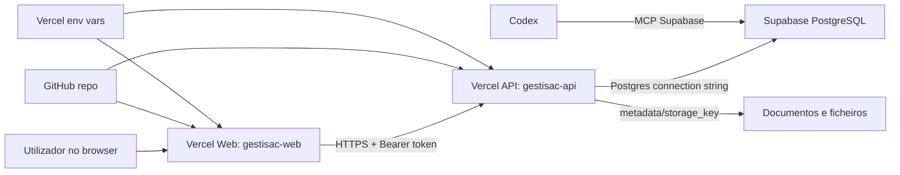
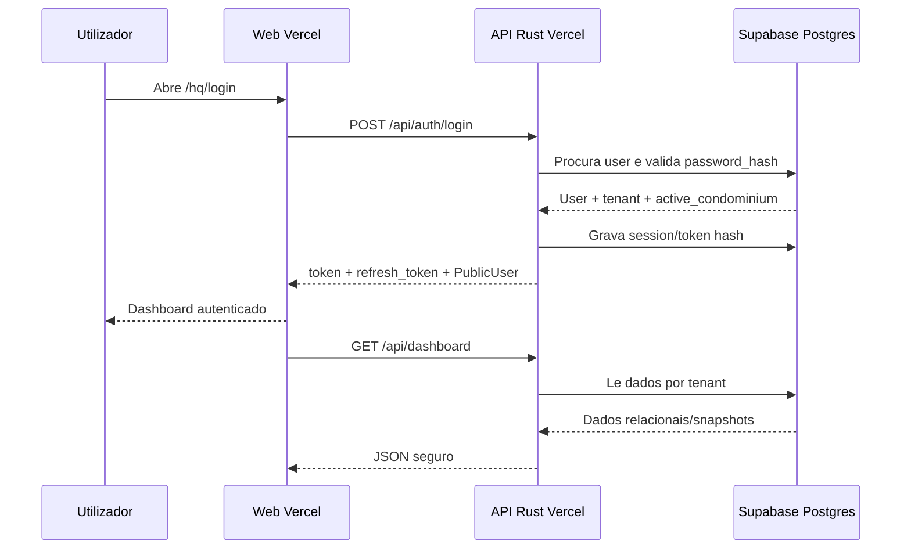
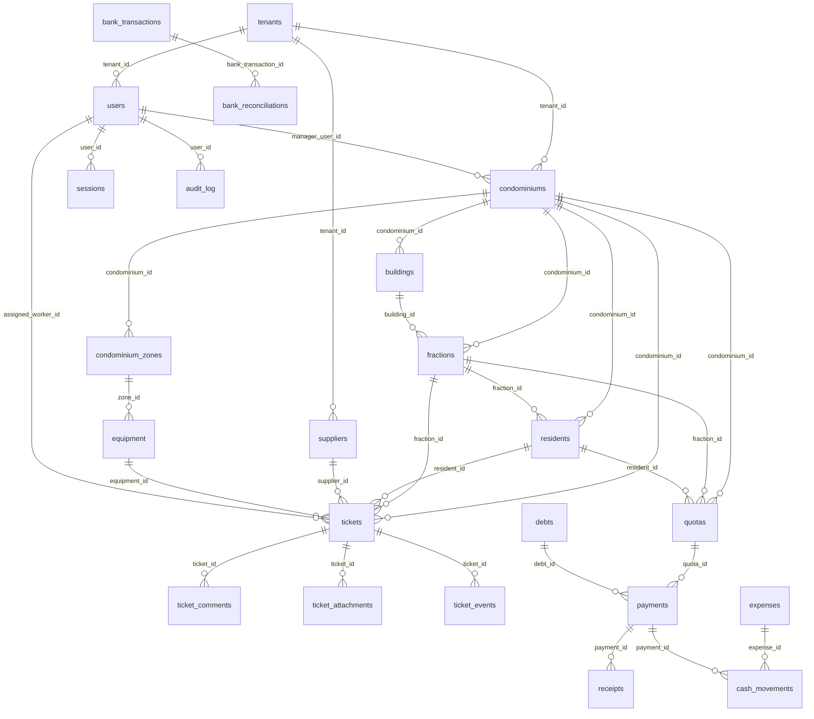
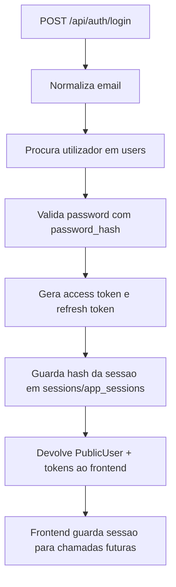
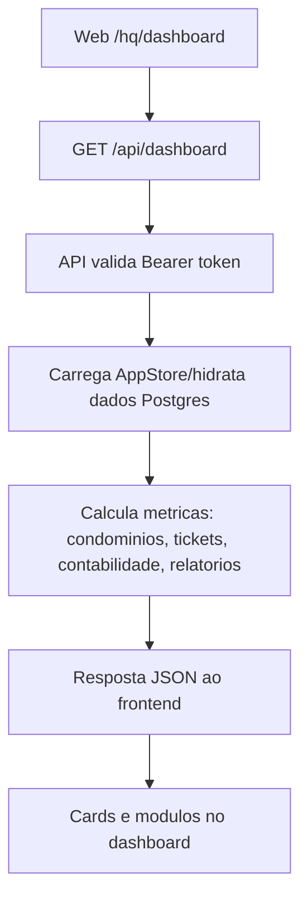
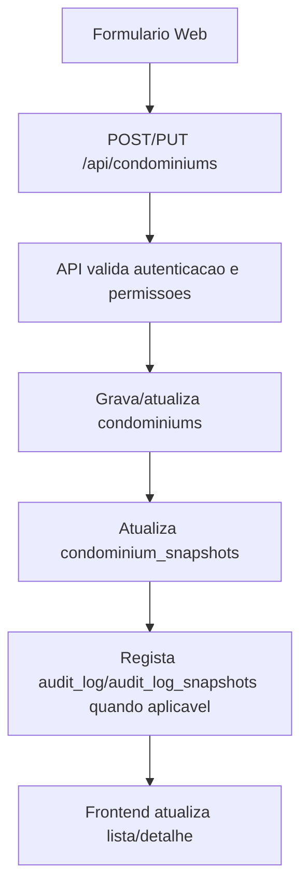
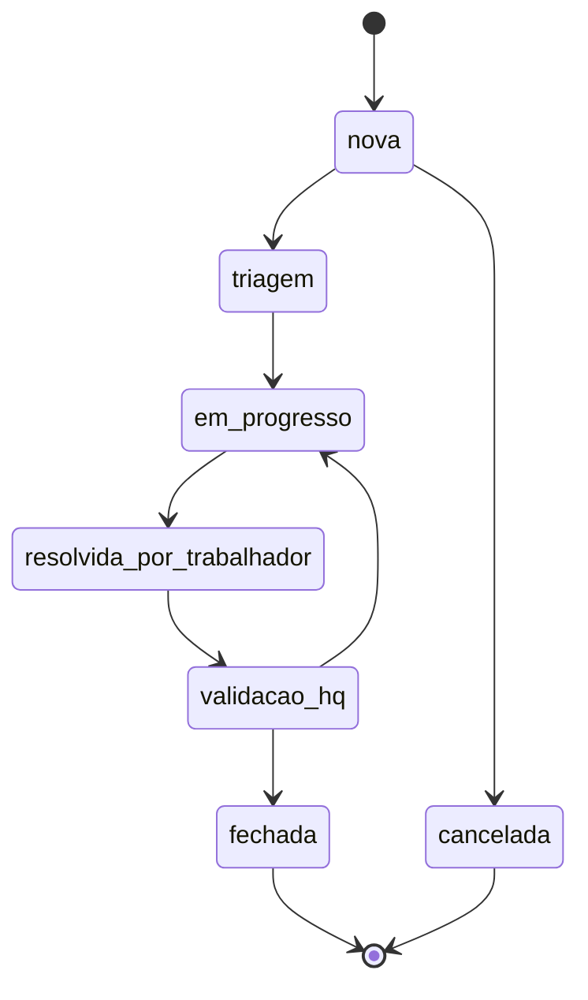
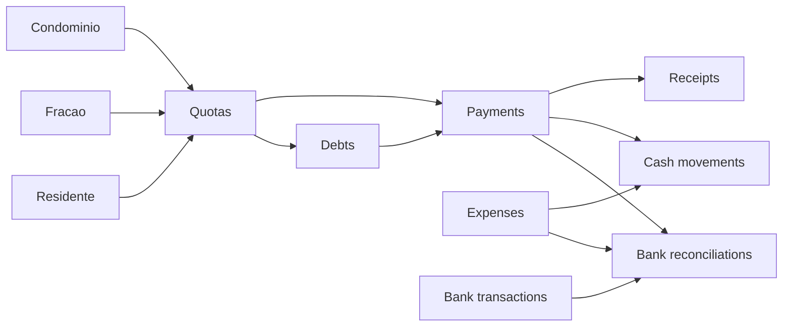
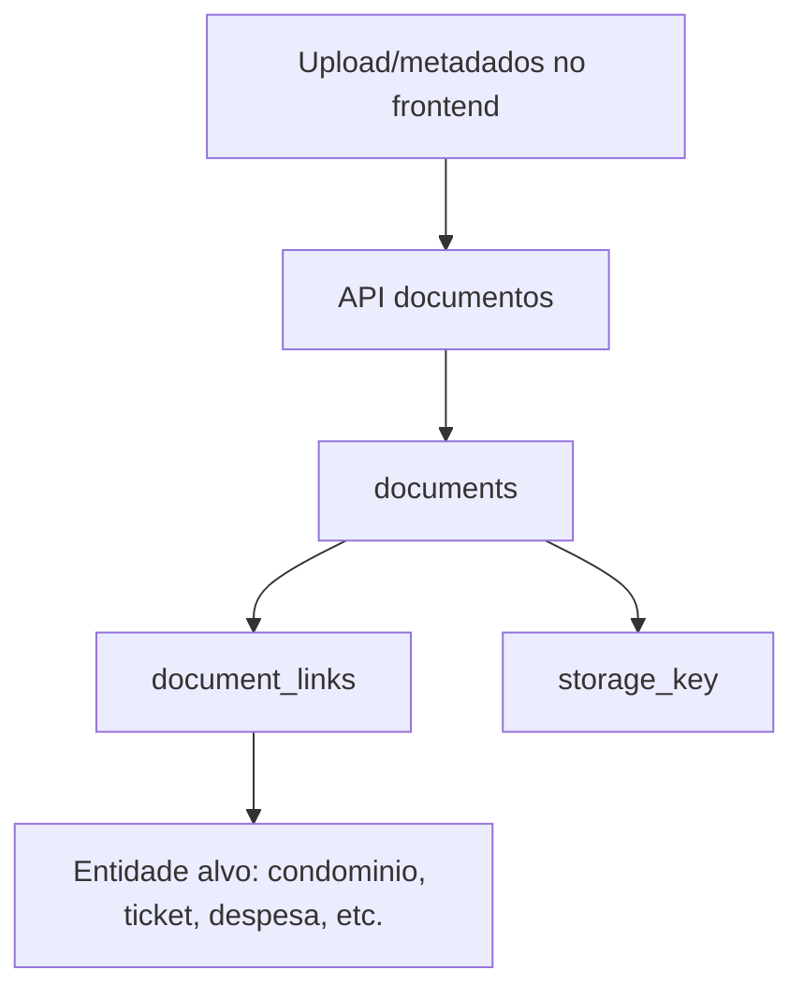
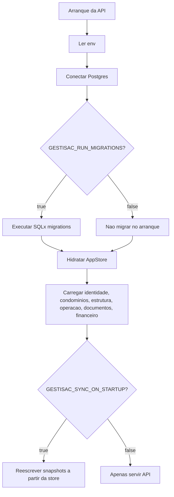

# Arquitetura do sistema, base de dados e fluxos

Estado verificado em 2026-06-04.

Este documento explica como o GESTISAC esta ligado entre frontend, API, Vercel, Supabase/Postgres, Codex e dados internos. Nao contem passwords, tokens nem connection strings completas.

## Resumo executivo

O GESTISAC esta configurado como uma aplicacao online gerida:

- Frontend Web: Vercel, projeto `gestisac-web`.
- Backend API: Vercel, projeto `gestisac-api`.
- Base de dados: Supabase PostgreSQL, schema `public`.
- Browser do utilizador: fala apenas com a API.
- API Rust: fala com Postgres atraves de `GESTISAC_DATABASE_URL`.
- Codex/Supabase MCP: usado apenas para desenvolvimento, auditoria e manutencao.
- PC local: usado apenas para desenvolvimento, nao para manter producao online.



## Configuracao de runtime

### Frontend Web

O frontend esta em `apps/web`.

Variavel principal:

```text
VITE_API_BASE_URL=https://gestisac-api.vercel.app
```

Logica:

- O bundle Web chama a API por `VITE_API_BASE_URL`.
- Em producao oficial, se a variavel falhar no build, existe fallback seguro apenas para `gestisac-web.vercel.app`.
- Clones noutros dominios nao devem usar automaticamente a API principal.
- O frontend nunca recebe `GESTISAC_DATABASE_URL`.
- O frontend nunca fala diretamente com Supabase/Postgres.

### Backend API

O backend esta em `apps/api`.

Variaveis principais:

```text
GESTISAC_DATABASE_URL
GESTISAC_ENV
JWT_SECRET
GESTISAC_CORS_ORIGINS
GESTISAC_RUN_MIGRATIONS
GESTISAC_SYNC_ON_STARTUP
GESTISAC_ALLOW_DEMO_SEED
GESTISAC_DATABASE_POOL_MAX
GESTISAC_DOCUMENT_STORAGE_PATH
```

Logica:

- `GESTISAC_DATABASE_URL` e obrigatorio.
- Em producao, a base de dados ativa e Postgres.
- O health check mostra a URL redigida, nunca a password.
- A API usa pool Postgres pequeno para ambiente serverless.
- SQLx tem cache de prepared statements desligada para compatibilidade com Supabase pooler.
- Producao usa Supabase pooler na porta `5432`.
- `GESTISAC_RUN_MIGRATIONS=false` no fluxo normal de producao.
- `GESTISAC_SYNC_ON_STARTUP=false` no fluxo normal de producao.
- `GESTISAC_ALLOW_DEMO_SEED=false` em producao.

## Como os componentes comunicam



## Modelo mental da base de dados

A base de dados tem dois estilos em simultaneo:

- Tabelas relacionais: modelo principal, com colunas fortes, foreign keys e soft delete.
- Tabelas `*_snapshots`: payload JSON historico/compatibilidade/arranque para partes ainda nao totalmente normalizadas.

Regras gerais:

- Quase todas as tabelas tem `tenant_id` para separar clientes/organizacoes.
- Soft delete usa `deleted_at`; apagar no produto normalmente marca como apagado/arquivado.
- `metadata jsonb` guarda campos flexiveis de dominio.
- `payload jsonb` nos snapshots guarda uma copia completa do objeto.
- RLS esta ativo nas tabelas publicas.
- Apesar de RLS estar ativo, o browser nao usa Supabase Data API diretamente.
- A autorizacao real do utilizador acontece na API Rust.
- Antes de expor Supabase diretamente no frontend, e preciso criar policies RLS por tenant/user.

## Diagrama ER simplificado



## Inventario de tabelas

Todas as `60` tabelas abaixo existem em `public`.

### Sistema e migracoes

| Tabela | Funcao | Ligacoes principais |
|---|---|---|
| `_sqlx_migrations` | Historico das migrations SQLx aplicadas. | Sem FK de dominio. |

### Identidade, tenants, sessoes e auditoria

| Tabela | Funcao | Ligacoes principais |
|---|---|---|
| `tenants` | Organizacoes/clientes dentro do sistema. | Raiz logica de quase todo o modelo. |
| `tenant_snapshots` | Snapshot JSON de tenants. | Sem FK fisica. |
| `users` | Utilizadores da aplicacao, password hash e condominio ativo. | `tenant_id -> tenants.id`. |
| `user_snapshots` | Snapshot publico/sanitizado do utilizador. | Sem FK fisica. |
| `roles` | Roles configuraveis por tenant. | `tenant_id -> tenants.id`. |
| `user_roles` | Relacao muitos-para-muitos entre users e roles. | `user_id -> users.id`, `role_id -> roles.id`, `tenant_id -> tenants.id`. |
| `sessions` | Sessoes autenticadas atuais/novas. | `tenant_id -> tenants.id`, `user_id -> users.id`. |
| `app_sessions` | Sessoes legadas/compatibilidade. | Sem FK fisica. |
| `audit_log` | Eventos auditaveis relacionais. | `tenant_id -> tenants.id`, `user_id -> users.id`. |
| `audit_log_snapshots` | Snapshot JSON do historico de auditoria. | Sem FK fisica. |

### Condominios e estrutura fisica

| Tabela | Funcao | Ligacoes principais |
|---|---|---|
| `condominiums` | Entidade central: condominio/edificio gerido. | `tenant_id -> tenants.id`, `manager_user_id -> users.id`. |
| `condominium_snapshots` | Snapshot JSON de condominios. | Sem FK fisica. |
| `buildings` | Blocos/edificios dentro de um condominio. | `tenant_id -> tenants.id`, `condominium_id -> condominiums.id`. |
| `fractions` | Fracoes/unidades. | `tenant_id -> tenants.id`, `condominium_id -> condominiums.id`, `building_id -> buildings.id`. |
| `residents` | Moradores/proprietarios associados a fracoes. | `tenant_id -> tenants.id`, `condominium_id -> condominiums.id`, `fraction_id -> fractions.id`. |
| `condominium_zones` | Zonas, pisos, areas comuns e locais com QR. | `tenant_id -> tenants.id`, `condominium_id -> condominiums.id`. |
| `equipment` | Equipamentos associados a condominio/zona. | `tenant_id -> tenants.id`, `condominium_id -> condominiums.id`, `zone_id -> condominium_zones.id`. |

### Tickets, avarias e ocorrencias

| Tabela | Funcao | Ligacoes principais |
|---|---|---|
| `tickets` | Modelo relacional principal para tickets, pedidos, avarias e fluxo tecnico. | `tenant_id -> tenants.id`, `condominium_id -> condominiums.id`, `fraction_id -> fractions.id`, `resident_id -> residents.id`, `supplier_id -> suppliers.id`, `zone_id -> condominium_zones.id`, `equipment_id -> equipment.id`, `assigned_worker_id -> users.id`, `created_by -> users.id`, `updated_by -> users.id`. |
| `ticket_comments` | Comentarios internos/publicos de tickets. | `tenant_id -> tenants.id`, `ticket_id -> tickets.id`, `author_id -> users.id`. |
| `ticket_attachments` | Anexos de tickets. | `tenant_id -> tenants.id`, `ticket_id -> tickets.id`, `uploaded_by -> users.id`. |
| `ticket_events` | Timeline/eventos de tickets. | `tenant_id -> tenants.id`, `ticket_id -> tickets.id`, `actor_id -> users.id`. |
| `ticket_snapshots` | Snapshot JSON de tickets. | Sem FK fisica. |
| `ocorrencia_snapshots` | Modelo antigo/compatibilidade de ocorrencias. | Sem FK fisica. |
| `ocorrencia_comment_snapshots` | Comentarios do modelo antigo de ocorrencias. | Sem FK fisica. |
| `ocorrencia_attachment_snapshots` | Anexos do modelo antigo de ocorrencias. | Sem FK fisica. |

### Operacao, manutencao, vistorias e calendario

| Tabela | Funcao | Ligacoes principais |
|---|---|---|
| `maintenance_items` | Manutencoes programadas/corretivas. | `tenant_id -> tenants.id`, `condominium_id -> condominiums.id`, `equipment_id -> equipment.id`, `created_by -> users.id`, `updated_by -> users.id`. |
| `maintenance_snapshots` | Snapshot JSON de manutencoes. | Sem FK fisica. |
| `inspections` | Vistorias/inspecoes. | `tenant_id -> tenants.id`, `condominium_id -> condominiums.id`, `assigned_worker_id -> users.id`, `created_by -> users.id`, `updated_by -> users.id`. |
| `inspection_snapshots` | Snapshot JSON de vistorias. | Sem FK fisica. |
| `calendar_events` | Eventos de calendario operacional. | `tenant_id -> tenants.id`, `condominium_id -> condominiums.id`, `created_by -> users.id`, `updated_by -> users.id`. |
| `calendar_event_snapshots` | Snapshot JSON de eventos. | Sem FK fisica. |
| `assembly_snapshots` | Assembleias ainda em modelo snapshot. | Sem FK fisica. |

### Documentos, relatorios e fornecedores

| Tabela | Funcao | Ligacoes principais |
|---|---|---|
| `documents` | Metadados de documentos. | `tenant_id -> tenants.id`, `created_by -> users.id`, `updated_by -> users.id`. |
| `document_links` | Liga documentos a entidades do sistema. | `tenant_id -> tenants.id`, `document_id -> documents.id`. `target_type` e `target_id` fazem ligacao polimorfica. |
| `document_snapshots` | Snapshot JSON de documentos. | Sem FK fisica. |
| `report_snapshots` | Relatorios ainda em modelo snapshot. | Sem FK fisica. |
| `suppliers` | Fornecedores/prestadores. | `tenant_id -> tenants.id`. |
| `supplier_snapshots` | Snapshot JSON de fornecedores. | Sem FK fisica. |

### Contabilidade e tesouraria

| Tabela | Funcao | Ligacoes principais |
|---|---|---|
| `quotas` | Quotas a cobrar. | `tenant_id -> tenants.id`, `condominium_id -> condominiums.id`, `fraction_id -> fractions.id`, `resident_id -> residents.id`, `created_by -> users.id`, `updated_by -> users.id`. |
| `quota_snapshots` | Snapshot JSON de quotas. | Sem FK fisica. |
| `payments` | Pagamentos recebidos. | `tenant_id -> tenants.id`, `condominium_id -> condominiums.id`, `fraction_id -> fractions.id`, `resident_id -> residents.id`, `quota_id -> quotas.id`, `debt_id -> debts.id`, `created_by -> users.id`, `updated_by -> users.id`. |
| `accounting_payment_snapshots` | Snapshot JSON de pagamentos contabilisticos. | Sem FK fisica. |
| `debts` | Dividas em aberto. | `tenant_id -> tenants.id`, `condominium_id -> condominiums.id`, `fraction_id -> fractions.id`, `resident_id -> residents.id`, `quota_id -> quotas.id`, `created_by -> users.id`, `updated_by -> users.id`. |
| `debt_snapshots` | Snapshot JSON de dividas. | Sem FK fisica. |
| `receipts` | Recibos emitidos. | `tenant_id -> tenants.id`, `condominium_id -> condominiums.id`, `fraction_id -> fractions.id`, `resident_id -> residents.id`, `payment_id -> payments.id`, `created_by -> users.id`, `updated_by -> users.id`. |
| `receipt_snapshots` | Snapshot JSON de recibos. | Sem FK fisica. |
| `expenses` | Despesas/contas a pagar. | `tenant_id -> tenants.id`, `condominium_id -> condominiums.id`, `supplier_id -> suppliers.id`, `document_id -> documents.id`, `created_by -> users.id`, `updated_by -> users.id`. |
| `expense_snapshots` | Snapshot JSON de despesas. | Sem FK fisica. |
| `payment_agreements` | Acordos de pagamento de dividas. | `tenant_id -> tenants.id`, `condominium_id -> condominiums.id`, `fraction_id -> fractions.id`, `resident_id -> residents.id`, `debt_id -> debts.id`, `created_by -> users.id`, `updated_by -> users.id`. |
| `payment_agreement_installments` | Prestacoes de um acordo. | `tenant_id -> tenants.id`, `agreement_id -> payment_agreements.id`, `payment_id -> payments.id`. |
| `payment_agreement_snapshots` | Snapshot JSON de acordos de pagamento. | Sem FK fisica. |
| `cash_movements` | Movimentos de caixa/banco derivados de pagamentos/despesas. | `tenant_id -> tenants.id`, `condominium_id -> condominiums.id`, `payment_id -> payments.id`, `expense_id -> expenses.id`, `created_by -> users.id`, `updated_by -> users.id`. |
| `cash_movement_snapshots` | Snapshot JSON de movimentos de caixa. | Sem FK fisica. |
| `bank_transactions` | Movimentos bancarios importados. | `tenant_id -> tenants.id`, `condominium_id -> condominiums.id`, `created_by -> users.id`, `updated_by -> users.id`. |
| `bank_transaction_snapshots` | Snapshot JSON de movimentos bancarios. | Sem FK fisica. |
| `bank_reconciliations` | Reconciliacao entre banco e objeto contabilistico. | `tenant_id -> tenants.id`, `bank_transaction_id -> bank_transactions.id`, `reconciled_by -> users.id`. |
| `bank_reconciliation_snapshots` | Snapshot JSON de reconciliacoes. | Sem FK fisica. |
| `reserve_fund_snapshots` | Fundo de reserva ainda em modelo snapshot. | Sem FK fisica. |

### Chat

| Tabela | Funcao | Ligacoes principais |
|---|---|---|
| `chat_message_snapshots` | Mensagens de chat guardadas como snapshot JSON. | Sem FK fisica. |

## Fluxos de dados principais

### Login e sessao



Notas:

- A password nunca e devolvida ao frontend.
- A API usa `password_hash` em `users`.
- `user_snapshots.payload` foi sanitizado e nao deve conter `passwordHash`.

### Dashboard



### Criar/editar condominio



### Ticket/ocorrencia



Fluxo:

- Um ticket pertence opcionalmente a condominio, fracao, residente, fornecedor, zona ou equipamento.
- Pode ter trabalhador atribuido por `assigned_worker_id`.
- Comentarios, anexos e eventos ficam em tabelas filhas.
- O modelo antigo de ocorrencias ainda existe em `ocorrencia_*_snapshots`.

### Contabilidade



Notas:

- `quotas`, `payments`, `debts`, `receipts`, `expenses`, `payment_agreements`, `cash_movements`, `bank_transactions` e `bank_reconciliations` sao o nucleo financeiro relacional.
- Alguns objetos financeiros continuam tambem espelhados em snapshots.
- `reserve_fund_snapshots` existe, mas nao existe tabela relacional `reserve_funds` no schema atual.

### Documentos



Nota importante:

- `documents` guarda metadados e `storage_key`.
- Vercel nao deve ser tratado como storage persistente.
- Para producao madura, ficheiros binarios devem ir para storage gerido como Supabase Storage ou S3.

## Casos de uso principais

| Caso de uso | Ator | Entrada | Tabelas principais | Resultado |
|---|---|---|---|---|
| Entrar no HQ | Administrador | Email/password | `users`, `sessions`, `app_sessions` | Token e dashboard autenticado. |
| Ver dashboard | Administrador | Token | `condominiums`, `tickets`, snapshots operacionais/financeiros | Metricas e avisos. |
| Gerir condominios | Administrador | Dados de condominio | `condominiums`, `condominium_snapshots`, `audit_log` | Lista/detalhe atualizado. |
| Gerir estrutura | Administrador | Blocos, fracoes, residentes, zonas, equipamento | `buildings`, `fractions`, `residents`, `condominium_zones`, `equipment` | Estrutura operacional do condominio. |
| Criar ticket | HQ/cliente/trabalhador | Pedido/avaria | `tickets`, `ticket_events`, `ticket_snapshots` | Ticket criado e rastreavel. |
| Comentar ticket | HQ/trabalhador/cliente | Comentario | `ticket_comments`, `ticket_events` | Historico atualizado. |
| Anexar ficheiro | HQ/trabalhador | Ficheiro/metadados | `ticket_attachments` ou `documents` | Anexo associado. |
| Gerir contabilidade | Administrador | Quotas, pagamentos, recibos, despesas | `quotas`, `payments`, `debts`, `receipts`, `expenses`, `cash_movements` | Estado financeiro atualizado. |
| Reconciliar banco | Administrador | Movimento bancario | `bank_transactions`, `bank_reconciliations` | Movimento conciliado. |
| Consultar documentos | Administrador | Filtros/entidade | `documents`, `document_links` | Lista de documentos. |
| Auditar atividade | Administrador/sistema | Acao de negocio | `audit_log`, `audit_log_snapshots` | Rasto de operacao. |

## Rotas API por modulo

| Modulo | Rotas principais |
|---|---|
| Health/version | `/api/health`, `/api/version` |
| Auth | `/api/auth/login`, `/api/auth/refresh`, `/api/auth/logout`, `/api/me`, `/api/permissions` |
| Dashboard | `/api/dashboard` |
| Chat | `/api/chat/messages` |
| Condominios | `/api/condominiums`, `/api/condominiums/{id}`, subrotas de estrutura, documentos, media, notas e alertas |
| Ocorrencias/tickets | `/api/tickets`, `/api/ocorrencias` e subrotas de comentarios/transicoes quando aplicavel |
| Contabilidade | `/api/accounting/summary`, `/api/accounting/overview`, `/api/accounting/quotas`, `/api/accounting/payments`, `/api/accounting/debts`, `/api/accounting/receipts`, `/api/accounting/expenses`, `/api/accounting/payment-agreements`, `/api/accounting/cash-movements`, `/api/accounting/bank-transactions`, `/api/accounting/reconciliations` |
| Recursos | `/api/buildings`, `/api/fractions`, `/api/residents`, `/api/suppliers`, `/api/documents`, `/api/reports`, `/api/maintenance`, `/api/inspections`, `/api/calendar-events`, `/api/assemblies` |

## Como a API carrega e persiste dados



Pontos importantes:

- A API mantem uma `AppStore` em memoria por instancia serverless.
- Em producao, a fonte de verdade e Postgres.
- Se dados forem alterados diretamente na base, pode ser preciso redeploy/restart para limpar memoria quente de uma funcao serverless antiga.
- Endpoints criticos devem ser testados do ponto de vista do utilizador, nao apenas com `/api/health`.

## Seguranca e limites atuais

O que esta correto:

- Passwords nao vao para o frontend.
- Hash de password fica em `users.password_hash`.
- `users.metadata` e `user_snapshots.payload` estao sanitizados.
- O browser nao tem connection string Postgres.
- CORS limita origens autorizadas.
- RLS esta ligado nas tabelas publicas.

O que ainda e risco/roadmap:

- RLS esta ligado, mas varias tabelas ainda nao tem policies desenhadas para acesso direto.
- Supabase Data API nao deve ser exposta diretamente ao frontend antes de policies por tenant/user.
- Existem varias tabelas `*_snapshots`; a longo prazo, alguns modulos devem migrar para relacional completo.
- Storage binario persistente deve ser formalizado fora do filesystem efemero da Vercel.
- Build Web tem chunk grande a otimizar no futuro.

## Regras para clones futuros

Para criar clone/site novo:

1. Criar novo projeto Supabase ou novo tenant conforme objetivo.
2. Nunca reutilizar secrets da producao principal.
3. Configurar `GESTISAC_DATABASE_URL` no projeto API correspondente.
4. Configurar `VITE_API_BASE_URL` no projeto Web correspondente.
5. Confirmar `GESTISAC_CORS_ORIGINS` com o dominio Web do clone.
6. Executar migrations/schema de forma controlada.
7. Popular dados iniciais sem passwords em metadata JSON.
8. Fazer deploy Web prebuilt pequeno.
9. Fazer deploy API pequeno.
10. Testar login e modulos reais no browser.

## Checklist de verificacao

```bash
curl https://gestisac-api.vercel.app/api/health
GESTISAC_SMOKE_PASSWORD=<password> pnpm run check:prod-api
npx vercel logs https://gestisac-api.vercel.app --since 15m --status-code 500 --json --cwd apps/api
pnpm run typecheck:web
pnpm run build:web
pnpm run check:api
node scripts/run-cargo.mjs fmt --manifest-path apps/api/Cargo.toml -- --check
pnpm run clippy:api
pnpm run test:api
```

Resultado esperado:

- `/api/health` devolve `activeBackend: postgresql`.
- Login real funciona no browser.
- Dashboard, Condominios, Tickets, Contabilidade, Documentos e Relatorios carregam sem erros.
- Sem `localhost` ou `127.0.0.1` como API de producao.
- Sem `500` nos endpoints usados pela UI.
- Sem secrets em docs, Git ou bundle frontend.
