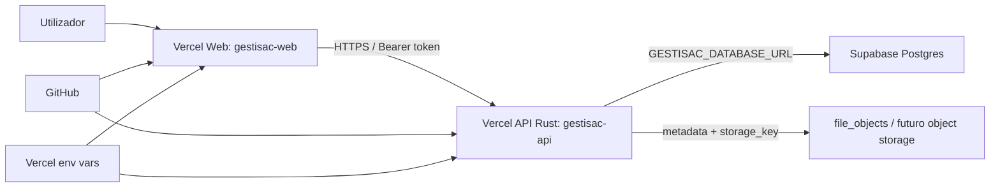

# Relatorio de estabilidade da base de dados e producao GESTISAC

Data: 2026-06-05  
Ultima atualizacao: 2026-06-05 07:36:27 +01:00  
Repositorio local: `C:\Users\josefeio\Desktop\git\gestisac`  
Frontend producao: <https://gestisac-web.vercel.app>  
API producao: <https://gestisac-api.vercel.app>  
Base de dados: Supabase/Postgres  
Estado do relatorio: final desta ronda, com pendencias humanas assinaladas

Este relatorio nao contem passwords, tokens, connection strings completas nem segredos.

Artefactos entregues para guardar:

- Markdown: `docs/RELATORIO-ESTABILIDADE-BASE-DADOS-GESTISAC.md`
- PDF: `docs/RELATORIO-ESTABILIDADE-BASE-DADOS-GESTISAC.pdf`

## Resumo executivo

O GESTISAC esta operacional online sem depender do PC local para servir Web/API. A API de producao responde com backend `postgresql`, ambiente `production`, `databaseConfigured=true`, demo seed desativado e storage documental configurado como `postgres`/persistente no health check.

Foram fechados ou melhorados pontos importantes:

- Root Directory dos projetos Vercel esta alinhado: `gestisac-api -> apps/api` e `gestisac-web -> apps/web`.
- O login publicado ja nao contem password demo pre-preenchida nem botao de login rapido.
- A password demo antiga foi rejeitada pela API com HTTP `401`.
- A navegacao publica das 3 apps foi testada no browser: menu inicial, Funcionarios, Clientes, HQ, voltar ao menu e back/forward.
- Upload/documentos deixam de depender apenas de filesystem efemero: o runtime esta preparado para backend `postgres:file_objects`.
- O deploy web foi endurecido para fazer build de producao antes de publicar prebuilt, reduzindo risco de deploy antigo.
- O deploy web passou a ter script dedicado com preflight: Root Directory Vercel, typecheck, build Vercel de producao, readiness real e modo `--preflight-only`.
- Foi adicionada auditoria local de migrations para apanhar riscos de clone/fresh DB.
- Foi adicionada migration local para ativar RLS explicitamente nas 60 tabelas publicas de dominio/snapshots.
- Foi criado auditor read-only de BD (`audit:prod-db`) que imprime apenas contagens/flags redigidas.
- O auditor read-only de BD foi reforcado para verificar views publicas sem `security_invoker`, funcoes publicas `SECURITY DEFINER`, funcoes definer executaveis por `anon`/`authenticated`, grants em sequencias, gaps de indices FK na BD real e documentos com `storage_key` sem `file_objects`.
- O auditor read-only de BD passou tambem a comparar migrations locais embutidas no binario com `_sqlx_migrations` da BD real: migrations locais em falta, migrations aplicadas que ja nao existem localmente, checksums divergentes e migrations sujas/sem sucesso.
- Foi criado check de prontidao de producao sem segredos (`check:prod-readiness`).
- O check de prontidao passou a varrer tambem assets JS/CSS publicados do frontend, nao apenas HTML, para apanhar localhost ou credenciais demo antigas dentro do bundle.
- O check de prontidao passou a validar o preflight CORS real de `POST /api/auth/login` a partir da origem web de producao, cobrindo um erro que bloquearia login no browser mesmo com `/api/health` verde.
- Foi adicionada migration local para revogar `EXECUTE` publico em funcoes existentes e futuras no schema publico.
- Foi criado auditor local de indices de foreign keys (`audit:fk-indexes`) para priorizar performance sem criar indices em massa.
- Foram adicionadas tres migrations pequenas de indices FK prioritarios para tickets, documentos, contabilidade, estrutura de condominios, sessoes/roles, manutencao, inspecoes e calendario.
- Foi adicionado `apps/api/build.rs` para garantir que alteracoes em migrations SQL recompilam o binario que usa `sqlx::migrate!`.
- O deploy manual da API foi endurecido com preflights locais e modo `--preflight-only`, sem alterar a Vercel atual.
- O preflight do deploy manual da API passou a incluir readiness real de producao antes de qualquer deploy, incluindo health, version, storage, CORS login, Web publica, assets publicados e rejeicao da password demo antiga.
- O comando final de deploy manual da API foi alinhado para executar `vercel deploy --cwd apps/api`, usando o projeto Vercel local da API em vez da raiz do repositorio.
- O preflight do deploy manual da API passou a exigir tambem `clippy -D warnings` e a suite de testes Rust antes de qualquer publicacao.
- Foi criado check explicito dos dois entrypoints da API: binario standalone `gestisac-api` para API always-on e binario serverless `server` para Vercel.
- A matriz de smoke autenticado foi preparada para validar login, refresh, `/api/me`, endpoints e logout nas 3 apps: HQ, Funcionarios e Clientes.
- O smoke autenticado passou a aceitar `--smoke-env-file <path>` e o readiness passou a aceitar `GESTISAC_SMOKE_ENV_FILE`, permitindo testar login/dashboard sem escrever passwords no chat nem no terminal.
- A auditoria estatica de migrations passou a bloquear `SECURITY DEFINER` sem revisao explicita e views sem `security_invoker`.

Ainda nao se pode fechar a estabilidade como 100% aceite porque ficaram pendencias que exigem confirmacao humana:

- Login autenticado real/dashboard nao foi repetido nesta ronda porque nao existe password local em env (`GESTISAC_SMOKE_PASSWORD`) nem ficheiro env indicado por `GESTISAC_SMOKE_ENV_FILE`.
- Ativar `GESTISAC_BOOTSTRAP_ADMIN_PASSWORD` em producao altera a password real do admin na BD; nao deve ser feito sem confirmacao explicita.
- Consulta SQL direta da BD real ainda requer `GESTISAC_DATABASE_URL` disponivel localmente; a Vercel CLI devolve as chaves de producao com valores vazios, o que impede a auditoria sem segredo local.
- A migration de RLS foi criada localmente, mas nao foi aplicada em producao nesta ronda.

## Arquitetura atual



Fluxo simplificado:

```text
Browser -> gestisac-web.vercel.app -> gestisac-api.vercel.app -> Supabase/Postgres
```

O frontend nao fala diretamente com Supabase/Postgres e nao tem connection string. A autorizacao efetiva passa pela API Rust.

## Estado inicial encontrado nesta ronda

### Repo local

O working tree esta sujo. Ha alteracoes modificadas e ficheiros novos nao versionados. Isto nao e necessariamente mau durante desenvolvimento, mas aumenta risco de perder contexto se houver deploy/commit apressado.

Ficheiros novos relevantes:

- `apps/api/migrations/20260604174426_harden_public_data_api_grants.sql`
- `apps/api/migrations/20260604203000_init_persistent_file_objects.sql`
- `apps/api/src/storage.rs`
- `apps/web/src/lib/api/batch.ts`
- `scripts/audit-database-migrations.mjs`
- `scripts/audit-foreign-key-indexes.mjs`
- `scripts/audit-production-database.mjs`
- `scripts/check-production-readiness.mjs`
- `scripts/check-api-entrypoints.mjs`
- `scripts/check-vercel-projects.mjs`
- `scripts/deploy-api-production.mjs`
- `apps/api/build.rs`
- `apps/api/src/bin/audit_database.rs`
- `apps/api/migrations/20260605061000_enable_public_table_rls.sql`
- `apps/api/migrations/20260605062000_harden_public_function_execute_grants.sql`
- `apps/api/migrations/20260605063000_add_priority_fk_indexes.sql`
- `apps/api/migrations/20260605064000_add_core_fk_indexes.sql`
- `apps/api/migrations/20260605065000_add_operational_fk_indexes.sql`

Categorias principais das alteracoes pendentes:

- API Rust: config, estado, storage, repositorio Postgres, rotas de documentos/media, version endpoint.
- Web/Qwik: login sem demo hardcoded, menu das 3 apps, refresh/navegacao, chamadas em lotes.
- Deploy/checks: Vercel root directories, deploy API, deploy web, env checks.
- Migrations: hardening de grants, `file_objects`, revoke guarded da funcao `rls_auto_enable`.
- Docs/runbooks.

Nao foi feito commit, stage, deploy nem migration em producao nesta ronda.

### Producao

Evidencia recolhida:

- `pnpm run check:vercel-projects`: passou.
- API `/api/health`: HTTP `200`.
- API health: `activeBackend=postgresql`.
- API health: `databaseConfigured=true`.
- API health: `documentStorageBackend=postgres`.
- API health: `documentStoragePersistent=true`.
- API health: `environment=production`.
- API health: `demoSeedAllowed=false`.
- API `/api/version`: HTTP `200`, `name=gestisac-api`, `version=0.1.0`, `environment=production`.
- Primeiro pedido `/api/health` medido nesta ronda demorou cerca de `25.2s`, consistente com cold start serverless.
- Pedido seguinte `/api/version` respondeu em cerca de `395ms`.
- Ultimo readiness executado em 2026-06-05 07:32: `health=25504ms`, `version=393ms`, CORS login `142ms`, paginas publicas web `120-385ms`, `4` assets publicados verificados e password demo antiga rejeitada em `191ms`.
- Readiness repetido em 2026-06-05 07:36: `health=400ms`, `version=371ms`, CORS login `141ms`, paginas publicas web `123-375ms`, `4` assets publicados verificados e password demo antiga rejeitada em `173ms`.
- As medicoes de aproximadamente `25s` em `/api/health` confirmam que o cold start serverless ainda e observavel em producao, mesmo quando medicoes seguintes ficam quentes.
- Logs Vercel API com filtro HTTP 500 nos ultimos 30 minutos: sem entradas devolvidas.

Variaveis Vercel confirmadas por nome, sem valores:

- API: `GESTISAC_DATABASE_URL`, `GESTISAC_ENV`, `JWT_SECRET`, `GESTISAC_CORS_ORIGINS`, `GESTISAC_RUN_MIGRATIONS`, `GESTISAC_SYNC_ON_STARTUP`, `GESTISAC_ALLOW_DEMO_SEED`, `GESTISAC_DOCUMENT_STORAGE_BACKEND`, `GESTISAC_DOCUMENT_STORAGE_PATH`, `GESTISAC_DATA_PATH`.
- Web: `VITE_API_BASE_URL`.
- `GESTISAC_BOOTSTRAP_ADMIN_PASSWORD` nao aparece listado em Production.

## Revisao API Rust

Pontos positivos confirmados no codigo/health:

- A API exige Postgres em runtime gerido/producao.
- `persistence_status` redige a URL da BD.
- Storage documental tem enum de backend (`filesystem`/`postgres`).
- Em runtime gerido com DB configurada, o default e `postgres`.
- Pool Postgres esta reduzido para ambiente serverless: default `1`, max clamp `4`.
- `/api/version` deixou de depender de campos vazios do store e usa metadata do Cargo.
- Bootstrap admin password exige env explicita e tamanho minimo; nao esta ativa em Production.
- Password demo hardcoded foi removida do estado/fluxo principal.

Riscos API:

- Cold start serverless ainda existe e foi medido em aproximadamente 25s no primeiro pedido.
- A API ainda usa AppStore em memoria por instancia; dados alterados diretamente na BD podem exigir restart/redeploy para limpar estado quente.
- `file_objects` em Postgres e persistente, mas guardar binarios em `BYTEA` nao e ideal para ficheiros grandes ou elevado volume.
- `GESTISAC_RUN_MIGRATIONS=true` em producao deve continuar a ser usado apenas em rollout controlado e temporario.

## Revisao Supabase/Postgres e migrations

Auditoria local de migrations:

- `pnpm run audit:migrations`: passou sem falhas bloqueantes.
- Migrations auditadas: `19`.
- Tabelas criadas pelas migrations: `60`.
- Tabelas com RLS explicito nas migrations locais: `60`.
- Warning anterior de 60 tabelas sem RLS explicito foi removido.

Estado de seguranca Data API:

- A UI atual nao usa Supabase Data API diretamente.
- A migracao `20260604174426_harden_public_data_api_grants.sql` revoga grants de `anon` e `authenticated` em tabelas/sequencias e default privileges.
- A migracao `20260605061000_enable_public_table_rls.sql` ativa RLS nas 60 tabelas publicas de dominio/snapshots conhecidas.
- A migracao `20260605062000_harden_public_function_execute_grants.sql` revoga `EXECUTE` publico em funcoes existentes no schema `public` e altera default privileges para novas funcoes.
- Isto e defesa em profundidade enquanto nao houver policies RLS por tenant/user.
- Antes de expor Supabase diretamente no frontend, sera obrigatorio desenhar policies RLS testadas.
- Auditoria local atual: `0` funcoes criadas, `0` views criadas e `0` policies criadas nas migrations locais.
- O auditor agora falha se uma migration introduzir `SECURITY DEFINER` sem marcador explicito de revisao ou uma view sem `WITH (security_invoker = true)`.

Estado de performance por foreign keys:

- Auditoria local detetou `121` foreign keys e `200` indices.
- A migration `20260605063000_add_priority_fk_indexes.sql` adiciona `23` indices FK prioritarios.
- A migration `20260605064000_add_core_fk_indexes.sql` adiciona `25` indices FK prioritarios.
- A migration `20260605065000_add_operational_fk_indexes.sql` adiciona `23` indices FK prioritarios.
- Os primeiros indices cobrem caminhos de maior uso: tickets, timeline operacional, documentos, `document_links`, pagamentos, dividas, despesas, acordos de pagamento, conciliacoes bancarias e movimentos de caixa.
- O segundo lote cobre sessoes/roles, estrutura de condominios, edificios, fracoes, residentes, zonas, equipamentos, quotas, pagamentos, dividas e recibos.
- O terceiro lote cobre autoria/contexto de tickets, documentos, manutencao, inspecoes, calendario e auditoria.
- Ficam `29` foreign keys sem indice lider nas migrations locais. Isto deve continuar por lotes pequenos para evitar criar indices de baixo valor.

Risco de clone corrigido:

- `202606040012_revoke_public_execute_rls_auto_enable.sql` agora usa `to_regprocedure('public.rls_auto_enable()')`.
- Isto evita falha em Supabase novo onde a funcao ainda nao exista.

Pendente:

- A auditoria SQL direta da BD real ainda nao foi concluida porque `vercel env pull` devolve `GESTISAC_DATABASE_URL` com valor vazio. Foi criado `pnpm run audit:prod-db`, que funciona quando `GESTISAC_DATABASE_URL` estiver definido no shell ou for passado um ficheiro via `--database-env-file`.
- Nao foi corrida migration em producao nesta ronda.
- Nao foram apagados residuos nem dados reais.

## Revisao frontend

Pontos positivos:

- Login publicado nao tem email/password demo pre-preenchidos.
- Botao `Entrar rapido (demo)` foi removido.
- Existe botao para voltar ao menu das apps.
- Menu inicial das 3 apps funciona.
- LocalStorage tem wrappers defensivos para browsers que bloqueiam storage.
- Troca de app deixa de fazer logout destrutivo por defeito.
- Back/forward do browser foi testado no fluxo publico.

Teste browser publico:

```text
Root -> menu inicial: OK
App Funcionarios -> /worker/login: OK
Voltar ao menu: OK
App Clientes -> /client/login: OK
Browser back -> menu: OK
Browser forward -> /client/login: OK
Voltar + GESTISAC HQ -> /hq/login: OK
Console errors: 0
Password demo no DOM: OK
```

Teste autenticado:

- A password demo antiga foi testada defensivamente e foi rejeitada com HTTP `401`.
- Login real/dashboard nao foi testado nesta ronda por falta de password em env.
- O script `pnpm run check:prod-api` foi reforcado para validar as 3 apps autenticadas quando `GESTISAC_SMOKE_PASSWORD` existir localmente.
- O mesmo smoke tambem aceita `pnpm run check:prod-api -- --smoke-env-file <path>`, permitindo usar um ficheiro local seguro que nao e impresso.
- O readiness pode correr o smoke autenticado quando `GESTISAC_SMOKE_ENV_FILE=<path>` existir no ambiente.
- Para testar sem expor segredo, usar `GESTISAC_SMOKE_PASSWORD`, `GESTISAC_SMOKE_ENV_FILE` ou introduzir a password diretamente no browser.

## Revisao deploy

Confirmado:

- `gestisac-api` Root Directory: `apps/api`.
- `gestisac-web` Root Directory: `apps/web`.
- `pnpm run check:vercel-projects` passa.
- `.vercelignore` ignora `node_modules`, targets, logs, screenshots, `.env.local`, `.vercel`, scripts de teste e payload local de login.

Melhoria aplicada nesta ronda:

- `deploy:web:prod` passou a usar `node scripts/deploy-web-production.mjs`.
- O novo script executa `check-vercel-projects`, `typecheck:web`, `vercel-build-web-production`, `check-production-readiness` e so depois permite `vercel deploy --prebuilt --cwd apps/web`.
- O modo `node scripts/deploy-web-production.mjs --preflight-only` valida o fluxo sem publicar.
- Isto evita publicar acidentalmente um `.vercel/output` antigo e tambem bloqueia deploy se typecheck/build/readiness falharem.

Riscos deploy:

- Existem varios artefactos locais rastreados historicamente no Git, como screenshots/logs/HTML de debug. `.vercelignore` protege o deploy, mas a limpeza Git deve ser feita em tarefa controlada.
- API serverless continua sujeita a cold start; para 24h/always-on, migrar runtime da API para servico persistente ou manter Vercel como fallback.

## Alteracoes realizadas nesta ronda

Ficheiros alterados agora:

- `package.json`
- `scripts/deploy-web-production.mjs`
- `apps/api/build.rs`
- `scripts/audit-database-migrations.mjs`
- `scripts/check-production-api.mjs`
- `scripts/audit-production-database.mjs`
- `apps/api/src/bin/audit_database.rs`
- `apps/api/migrations/20260605061000_enable_public_table_rls.sql`
- `apps/api/migrations/20260605062000_harden_public_function_execute_grants.sql`
- `apps/api/migrations/20260605063000_add_priority_fk_indexes.sql`
- `apps/api/migrations/20260605064000_add_core_fk_indexes.sql`
- `apps/api/migrations/20260605065000_add_operational_fk_indexes.sql`
- `docs/RELATORIO-ESTABILIDADE-BASE-DADOS-GESTISAC.md`
- `docs/RELATORIO-ESTABILIDADE-BASE-DADOS-GESTISAC.pdf`

Alteracoes:

- Adicionado script `audit:migrations`.
- Adicionada auditoria estatica de migrations:
  - deteta versoes duplicadas;
  - deteta `CREATE TABLE`/`CREATE INDEX` sem `IF NOT EXISTS`;
  - deteta revoke de `public.rls_auto_enable()` sem guard;
  - avisa sobre grants para `anon`/`authenticated`;
  - avisa sobre tabelas sem RLS explicito em migrations;
  - bloqueia `SECURITY DEFINER` sem marcador explicito de revisao;
  - bloqueia views sem `security_invoker`;
  - conta funcoes, views e policies criadas;
  - valida ordem entre hardening de grants e `file_objects`.
- `deploy:web:prod` agora usa `scripts/deploy-web-production.mjs`.
- Adicionado `scripts/deploy-web-production.mjs` com preflights para deploy web: roots Vercel, `typecheck:web`, build Vercel de producao e readiness real antes de publicar.
- Adicionado `audit:prod-db` para auditoria read-only redigida da BD quando a connection string estiver disponivel localmente.
- `audit:prod-db` foi reforcado para auditar a BD real com mais cobertura: grants em sequencias para `anon`/`authenticated`, views publicas sem `security_invoker`, funcoes publicas totais, funcoes publicas `SECURITY DEFINER`, funcoes `SECURITY DEFINER` executaveis por roles API, foreign keys sem indice lider na BD real e documentos ativos com `storage_key` sem objeto persistente em `file_objects`.
- `audit:prod-db` passou a comparar as migrations locais embutidas por `sqlx::migrate!("./migrations")` com as linhas de `_sqlx_migrations` da BD real, sem executar migrations.
- Adicionado `check:prod-readiness` para validar Vercel, migrations, API health/version, Web publicada, ausencia de hints demo e rejeicao da password demo antiga.
- `check:prod-readiness` passou a recolher assets JS/CSS same-origin referenciados nas paginas publicas e a falhar se encontrar `localhost`, `127.0.0.1`, password demo antiga ou `Entrar rapido` no bundle publicado.
- `check:prod-readiness` passou a validar `OPTIONS /api/auth/login` com `Origin=https://gestisac-web.vercel.app`, metodo `POST` e headers `content-type,authorization`.
- Adicionado `audit:fk-indexes` para encontrar FKs sem indice com a coluna FK como primeiro campo.
- Adicionada migration de RLS explicito para as 60 tabelas publicas de dominio/snapshots.
- Adicionada migration de hardening de funcoes/RPC para revogar execucao publica existente e futura.
- Adicionada migration pequena com 23 indices FK prioritarios para reduzir custo de joins/delete/update checks em tickets, documentos e contabilidade.
- Adicionada segunda migration pequena com 25 indices FK prioritarios para estrutura de condominios, residentes, sessoes/roles e contexto financeiro.
- Adicionada terceira migration pequena com 23 indices FK prioritarios para tickets/documentos, manutencao, inspecoes, calendario e auditoria.
- Adicionado `apps/api/build.rs` com `cargo:rerun-if-changed` para a pasta `migrations` e ficheiros `.sql`.
- `scripts/audit-database-migrations.mjs` agora falha se o guard de rebuild das migrations embutidas por `sqlx::migrate!` desaparecer.
- `scripts/deploy-api-production.mjs` agora executa preflights antes de deploy: roots Vercel, auditoria de migrations, auditoria FK, `check:api`, `fmt --check`, `clippy -D warnings` e testes Rust.
- `scripts/check-api-entrypoints.mjs` foi adicionado para compilar explicitamente `--bin gestisac-api` e `--bin server`.
- `scripts/deploy-api-production.mjs` passou a incluir `scripts/check-api-entrypoints.mjs`, garantindo que Vercel atual e runtime always-on futuro continuam compilaveis antes de qualquer deploy API.
- `scripts/deploy-api-production.mjs` agora tambem executa `scripts/check-production-readiness.mjs` antes de permitir deploy de producao.
- `scripts/deploy-api-production.mjs` passou a chamar `vercel deploy` com `--cwd apps/api`, alinhado com `apps/api/.vercel/project.json` e com o Root Directory do projeto API.
- `scripts/deploy-api-production.mjs --preflight-only` permite validar esses gates sem publicar nada.
- `scripts/check-production-api.mjs` agora cobre os contextos `hq`, `worker` e `client`, incluindo login, `/api/me`, refresh token, endpoints representativos por app e logout.
- `scripts/check-production-api.mjs` agora aceita `--smoke-env-file <path>` para carregar `GESTISAC_SMOKE_PASSWORD` localmente sem imprimir valores.
- `scripts/check-production-readiness.mjs` agora usa `GESTISAC_SMOKE_ENV_FILE` quando existir, mantendo o smoke autenticado como pendente quando nao ha segredo local.
- `scripts/audit-production-database.mjs` agora documenta `--database-env-file <path>` para evitar colisao com a flag nativa `--env-file` do Node.
- `scripts/check-production-env.mjs` agora aceita `--production-env-file <path>` pelo mesmo motivo.
- `scripts/check-production-env.mjs` agora tem `--help` documentado e falha cedo, com mensagem limpa, se o ficheiro env indicado nao existir.

Nao realizado:

- Nao houve deploy.
- Nao houve migration em producao.
- Nao houve alteracao de dados reais.
- Nao houve impressao de credenciais.

## Testes executados e resultados

### Locais

```text
pnpm run typecheck:web: PASS
pnpm run build:web: PASS
pnpm run check:api: PASS
node scripts/run-cargo.mjs fmt --manifest-path apps/api/Cargo.toml -- --check: PASS
pnpm run clippy:api: PASS
pnpm run test:api: PASS, 101 testes
node --check scripts/audit-database-migrations.mjs: PASS
node --check scripts/deploy-api-production.mjs: PASS
node --check scripts/deploy-web-production.mjs: PASS
node --check scripts/check-api-entrypoints.mjs: PASS
node --check scripts/check-production-api.mjs: PASS
node --check scripts/check-production-readiness.mjs: PASS
node --check scripts/check-production-env.mjs: PASS
pnpm run check:prod-env -- --help: PASS, documenta `--production-env-file <path>` e politica de nao imprimir segredos
node scripts/check-production-api.mjs --help: PASS, documenta `--smoke-env-file <path>` e politica de nao imprimir segredos
node scripts/audit-production-database.mjs --help: PASS, documenta `--database-env-file <path>` e politica de nao imprimir connection string
pnpm run check:api-entrypoints: PASS, bins `gestisac-api` e `server`
node scripts/deploy-api-production.mjs --preflight-only: PASS, deploy skipped, com clippy, 101 testes Rust e readiness de producao incluidos
node scripts/deploy-web-production.mjs --preflight-only: PASS, deploy skipped, com typecheck, build Vercel de producao e readiness de producao incluidos
pnpm run audit:migrations: PASS, 19 migrations, 60 tabelas com RLS explicito, 0 funcoes, 0 views, 0 policies, funcoes publicas existentes/futuras protegidas
pnpm run audit:fk-indexes: PASS, 121 FKs, 200 indices, 29 FKs sem indice lider
pnpm run audit:prod-db -- --help: PASS
pnpm run audit:prod-db: FAIL esperado sem GESTISAC_DATABASE_URL local; Vercel env pull devolveu chave vazia; nao imprimiu segredo
pnpm run audit:prod-db -- --database-env-file <missing>: FAIL esperado, mensagem limpa, nao imprimiu connection string
pnpm run check:prod-api: FAIL esperado sem GESTISAC_SMOKE_PASSWORD local; password/token nao foram impressos
pnpm run check:prod-api -- --smoke-env-file <missing>: FAIL esperado, mensagem limpa, password/token nao foram impressos
node scripts/check-production-env.mjs --production-env-file <missing>: FAIL esperado, mensagem limpa e sem cascata de envs em falta, nao imprimiu valores
pnpm run check:prod-readiness: PASS com CORS login validado, 4 assets publicados verificados, warnings de 29 FKs sem indice lider e GESTISAC_SMOKE_PASSWORD/GESTISAC_SMOKE_ENV_FILE ausentes
git diff --check: PASS, apenas avisos CRLF
```

Aviso local relevante:

- Build web continua com chunk grande (`q-BTt32e3U.js`, cerca de 733 kB minificado, `189 kB` gzip). Nao bloqueia, mas e melhoria futura.

### Producao

```text
pnpm run check:vercel-projects: PASS
GET /api/health: 200
GET /api/version: 200
Vercel API logs 500 ultimos 30m: sem entradas devolvidas
Browser menu/login das 3 apps: PASS
Password demo antiga: rejeitada com 401
check:prod-readiness: PASS em execucao direta; medicao anterior apanhou cold start em `/api/health` cerca de 25504ms; ultima medicao quente teve `/api/health` cerca de 400ms, `/api/version` cerca de 371ms, CORS login cerca de 141ms, paginas publicas das 3 apps entre 123ms e 375ms, 4 assets publicados verificados e password demo antiga rejeitada em cerca de 173ms
```

Pendente:

```text
GESTISAC_SMOKE_PASSWORD=<password> pnpm run check:prod-api
pnpm run check:prod-api -- --smoke-env-file <path>
GESTISAC_SMOKE_ENV_FILE=<path> pnpm run check:prod-readiness
Matriz coberta quando a env existir: hq, worker, client, login, /api/me, refresh, endpoints por app e logout
Browser login real -> dashboard -> navegar 3 apps autenticado
```

## Riscos por prioridade

### Alta

- Dashboard/login autenticado ainda nao foi revalidado nesta ronda por falta de password local em env.
- API serverless pode sofrer cold start alto; foi medido cerca de 25s no primeiro pedido.
- A migration local de RLS ainda nao foi aplicada em producao; aplicar exige confirmacao operacional.

### Media/alta

- Documentos em `file_objects` sao persistentes, mas binarios em Postgres podem crescer mal para ficheiros grandes; plano recomendado e Supabase Storage/S3 para volume real.
- Alterar bootstrap password em producao muda a password real persistida na BD; nao deve ser tratado como teste temporario inocuo.
- Working tree esta grande e sujo; consolidar commit limpo reduz risco operacional.

### Media

- Build web tem chunk grande.
- Auditoria local ainda encontra 29 foreign keys sem indice lider; isto deve continuar por lotes pequenos e idealmente cruzado com estatisticas reais/Index Advisor antes de criar mais indices.
- Varios artefactos de debug/screenshot existem no historico Git; `.vercelignore` protege deploy, mas limpeza controlada e recomendada.
- Consulta SQL direta da BD real agora tem script dedicado, mas precisa de `GESTISAC_DATABASE_URL` local porque a Vercel CLI nao devolve valores sensiveis.

### Baixa

- Avisos CRLF no `git diff --check`; nao bloqueiam comportamento, mas podem gerar ruido.

## Melhorias seguras recomendadas

1. Configurar `GESTISAC_SMOKE_PASSWORD` localmente ou usar `pnpm run check:prod-api -- --smoke-env-file <path>`, sem imprimir valores, para validar HQ, Funcionarios e Clientes.
2. Testar browser autenticado: login HQ, dashboard, Condominios, Tickets, Contabilidade, Documentos, Relatorios, sair e voltar.
3. Confirmar e aplicar a migration local `20260605061000_enable_public_table_rls.sql` em rollout controlado.
4. Correr `pnpm run audit:prod-db` com `GESTISAC_DATABASE_URL` local ou `--database-env-file` seguro, sem imprimir valores.
5. Continuar indices FK por lotes pequenos para as 29 FKs pendentes, priorizando apenas quando houver uso real em financeiro/recibos/conciliacao ou bloqueios de FK.
6. Migrar storage binario de longo prazo para Supabase Storage/S3, mantendo `documents.storage_key` como referencia.
7. Limpar artefactos rastreados historicos num commit dedicado, sem apagar dados reais de negocio.
8. Otimizar chunk grande no frontend com split por modulos.

## Plano para API 24h/always-on

Objetivo: mover a API para runtime persistente sem quebrar Vercel atual.

1. Manter Vercel API atual como fallback.
2. Escolher servico always-on com deploy Docker/Rust: Fly.io, Render, Railway, DigitalOcean App Platform ou VM pequena.
3. Usar as mesmas envs, sem expor valores: `GESTISAC_DATABASE_URL`, `GESTISAC_ENV=production`, `JWT_SECRET`, `GESTISAC_CORS_ORIGINS`, `GESTISAC_DOCUMENT_STORAGE_BACKEND=postgres`.
4. Configurar pool pequeno inicialmente: `GESTISAC_DATABASE_POOL_MAX=2` ou `4`, conforme limites Supabase.
5. Deploy da API always-on em URL nova, por exemplo `https://api-nova.example.com`.
6. Validar:
   - `/api/health`;
   - `/api/version`;
   - `GESTISAC_SMOKE_PASSWORD=<password> pnpm run check:prod-api`;
   - `pnpm run check:prod-api -- --smoke-env-file <path>`;
   - login real no browser;
   - dashboard e modulos.
7. Adicionar a nova origem web/API ao CORS, sem remover Vercel ainda.
8. Criar clone/staging do frontend com `VITE_API_BASE_URL` apontado para a API always-on.
9. Quando estabilizar, trocar `VITE_API_BASE_URL` de producao para a API always-on e fazer deploy web.
10. Manter Vercel API como fallback por 1-2 semanas.
11. Depois, decidir se Vercel API fica como backup ou e desativada.

Rollback simples:

- Repor `VITE_API_BASE_URL=https://gestisac-api.vercel.app`.
- Redeploy do frontend.
- Manter mesma BD Supabase.

## Criterios de aceitacao

Aceite agora:

- Web e API online.
- API usa Postgres em producao.
- Health confirma storage documental persistente.
- Root Directory Vercel alinhado.
- Migrations locais preparadas com RLS explicito para as 60 tabelas publicas de dominio/snapshots.
- Migrations locais preparadas para revogar `EXECUTE` publico em funcoes/RPC existentes e futuras.
- Auditoria local bloqueia novas funcoes `SECURITY DEFINER` ou views sem `security_invoker` sem revisao.
- Auditor read-only de BD criado e compilado.
- Auditor read-only de BD agora cobre tambem views, funcoes `SECURITY DEFINER`, grants em sequencias, gaps FK na BD real e consistencia basica `documents` -> `file_objects`.
- Auditor read-only de BD agora compara migrations locais vs `_sqlx_migrations` para detetar migrations por aplicar, migrations aplicadas fora do codigo local, checksums divergentes e dirty migrations.
- Auditor local de FKs/indices criado e integrado no readiness como warning.
- Tres lotes de indices FK prioritarios criados localmente: 23 no primeiro lote, 25 no segundo e 23 no terceiro; ainda nao aplicados em producao.
- Build da API passa a observar alteracoes em migrations SQL embutidas pelo `sqlx::migrate!`, reduzindo risco de binario sem migrations novas.
- Deploy manual da API passa a ter preflights locais obrigatorios e modo de ensaio sem deploy.
- Deploy manual da API passa a executar readiness de producao antes de publicar, reduzindo risco de deploy com producao ja degradada ou frontend/API desalinhados.
- Deploy manual da API fica alinhado com `--cwd apps/api`, reduzindo risco de deploy CLI a partir da raiz errada do monorepo.
- Deploy manual da API passa a bloquear publicacao se `clippy -D warnings` ou algum dos 101 testes Rust falhar.
- Deploy manual da API passa a bloquear publicacao se o entrypoint standalone `gestisac-api` ou o entrypoint Vercel `server` deixarem de compilar.
- Deploy manual da Web passa a bloquear publicacao se Root Directory Vercel, typecheck, build Vercel de producao ou readiness real falharem.
- Smoke autenticado de producao preparado para validar as 3 apps quando existir `GESTISAC_SMOKE_PASSWORD` local ou `--smoke-env-file <path>`.
- Check de prontidao de producao sem segredos criado e executado com sucesso.
- Check de prontidao de producao agora verifica tambem assets JS/CSS publicados para evitar regressao de credenciais demo no bundle frontend.
- Check de prontidao de producao agora valida tambem CORS do login a partir da origem web de producao.
- Login publico sem credenciais demo.
- Password demo antiga rejeitada.
- Menu das 3 apps e navegacao publico/back/forward funcionam.
- Checks locais principais passam.
- Nao foram expostos segredos.
- Nao foram apagados dados reais.

Ainda nao aceite:

- Login real/dashboard autenticado ainda nao validado nesta ronda.
- Matriz autenticada `check:prod-api` ainda nao executada com password real em env ou ficheiro env local.
- Auditoria SQL direta completa da BD real executada contra producao.
- RLS local esta preparado, mas aplicacao em producao e policies completas para Supabase Data API direta continuam pendentes.
- Estrategia definitiva de storage para ficheiros grandes.
- API always-on implementada.

## Pendencias que exigem confirmacao humana

1. Confirmar como testar login real:
   - preferido: colocar `GESTISAC_SMOKE_PASSWORD` localmente ou usar `pnpm run check:prod-api -- --smoke-env-file <path>` sem escrever o valor no chat;
   - alternativa: o utilizador introduz password no browser visivel;
   - nao recomendado sem confirmacao: ativar `GESTISAC_BOOTSTRAP_ADMIN_PASSWORD`, porque muda a password real do admin na BD.
2. Confirmar se se pode criar/aplicar migration de `ENABLE ROW LEVEL SECURITY` em todas as tabelas publicas.
3. Disponibilizar `GESTISAC_DATABASE_URL` localmente ou ficheiro env seguro para correr `pnpm run audit:prod-db`.
4. Confirmar se a limpeza de artefactos historicos rastreados no Git pode ser feita.
5. Confirmar provider alvo para API always-on.
6. Confirmar se documentos grandes devem ir para Supabase Storage ou S3.

## Garantias desta ronda

- Nao imprimi passwords, tokens, connection strings completas nem secrets.
- Nao apaguei dados reais.
- Nao corri comandos destrutivos sobre a BD.
- Nao corri migrations em producao.
- Nao fiz deploy.
- Nao fiz commit nem stage.
- Parei a tentativa de consulta SQL direta contra producao quando ficou confirmado que a CLI devolve valores sensiveis vazios e nao ha `GESTISAC_DATABASE_URL` local.

## Fontes e referencias

- Supabase - Securing your API: <https://supabase.com/docs/guides/api/securing-your-api>
- Supabase - Row Level Security: <https://supabase.com/docs/guides/database/postgres/row-level-security>
- Supabase changelog - Tables not exposed to Data and GraphQL API automatically: <https://supabase.com/changelog/45329-breaking-change-tables-not-exposed-to-data-and-graphql-api-automatically>
- SQLx - `migrate!` macro and recompilation note: <https://docs.rs/sqlx/latest/sqlx/macro.migrate.html>
- Documento local: `docs/33-operacao-deploy-e-clones.md`
- Documento local: `docs/34-auditoria-estado-online-2026-06-03.md`
- Documento local: `docs/35-arquitetura-sistema-base-dados-fluxos.md`
